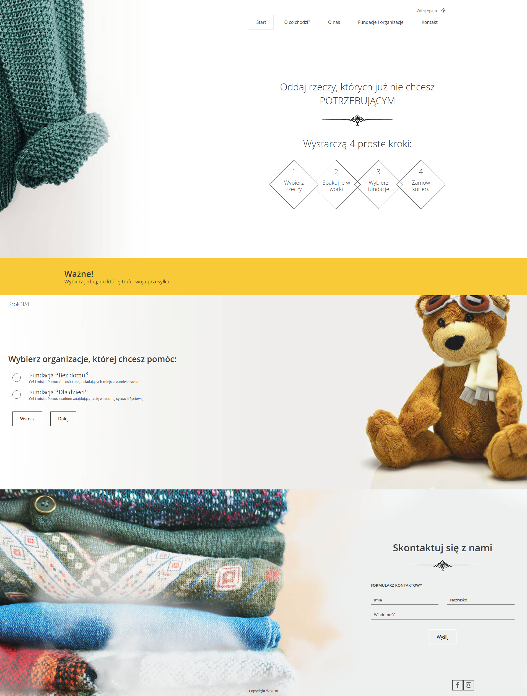
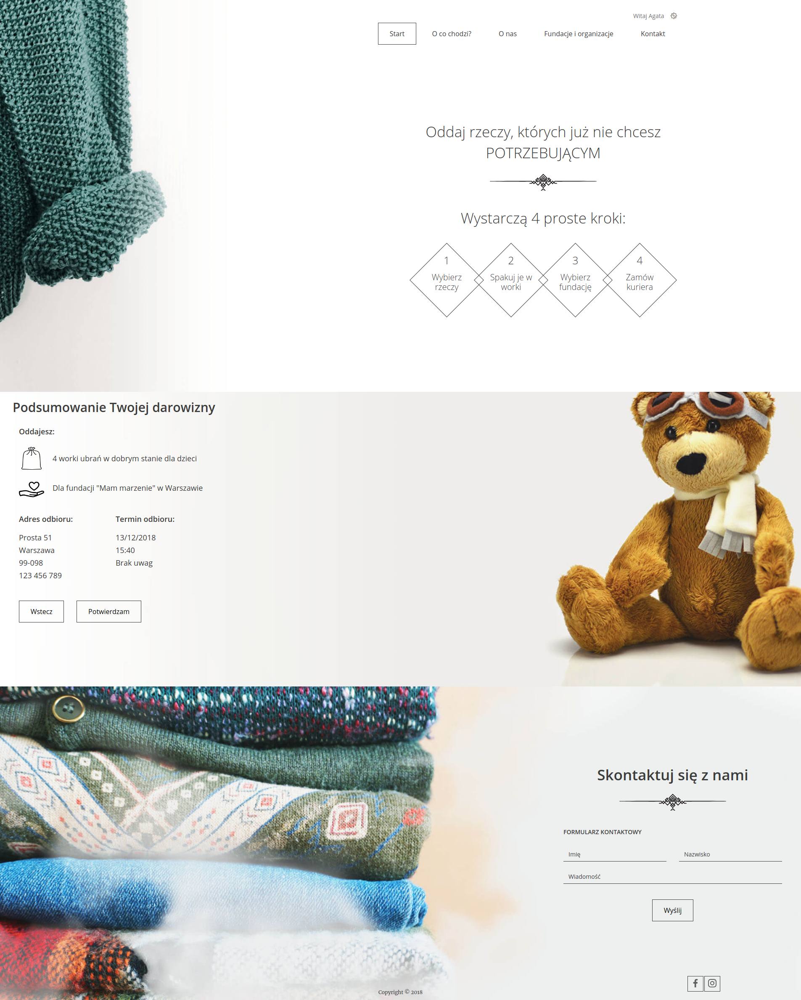
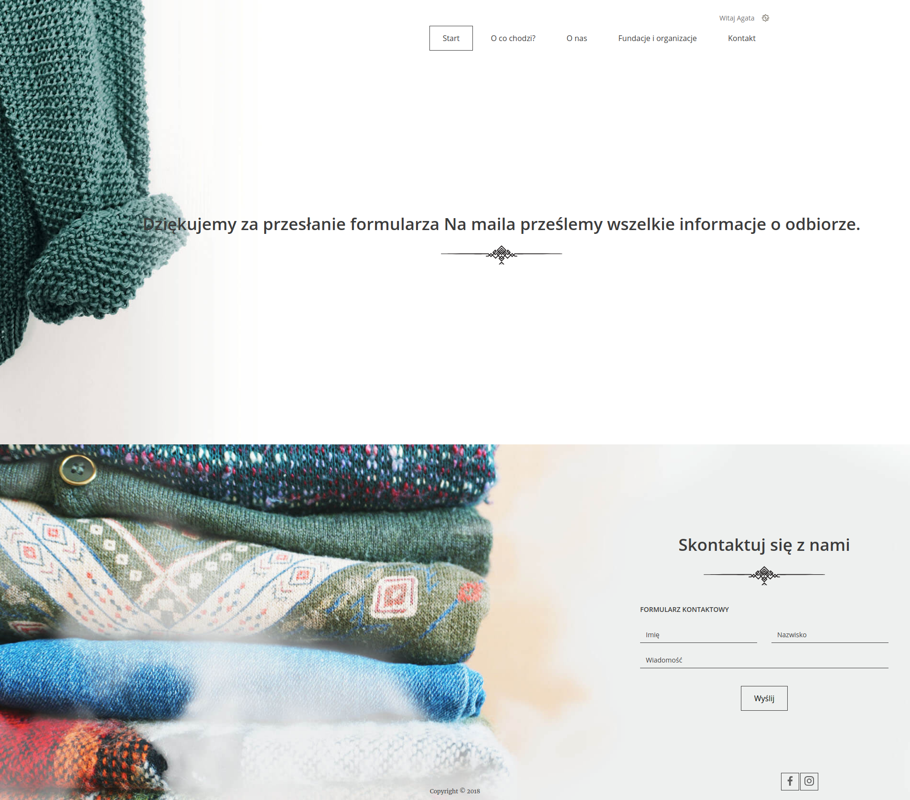

# Charity

Charity is an web application to donate unused items for various institutions.

## Features

- Adding donations in various categories
- Choosing Institution to donate

## Instruction
Login
Click `przekaż dary`

Choose donation items category

Type how much You would like to donate

Choose Institution - You will see only institutions which would gladly take Your donation

Fill the collection form

You can check if everything is OK

And... voilà! The delivery man is on his way!
